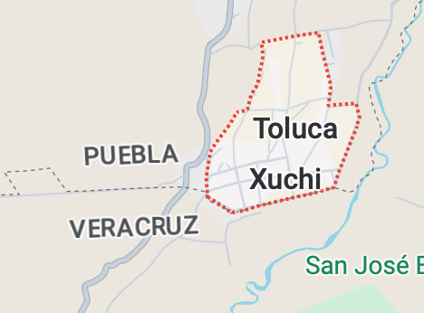
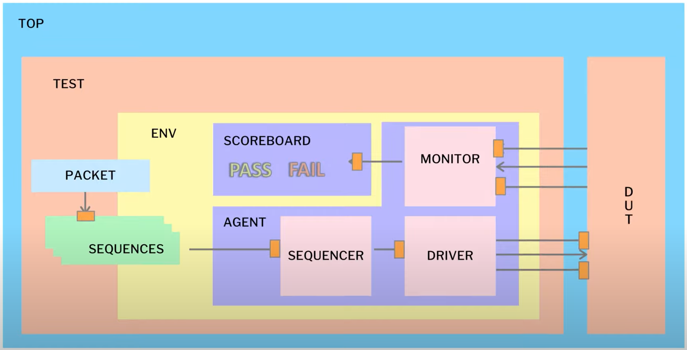

#  UVM Verification

Este proyecto tiene como objetivo que el usuario entienda como se construye una arquitectura UVM Básica.




The UVM architecture consists of many modules, where each module has a specific task.
The following figure shows how this architecture is connected using the UVM hierarchy:
- Top
  - Test
    - Environment
      - Agent 
        - Monitor
        - Driver
        - Sequencer
- DUT    



## Setup

A continuación se colocan una serie de comando que deben ejecutarse desde terminal.

```bash
export GIT_ROOT=$(git rev-parse --show-toplevel)
export UVM_WORK="$GIT_ROOT/work/uvm"
mkdir -p work/uvm && cd work/uvm
ln -sf $GIT_ROOT/verification/uvm/scripts/makefiles/Makefile.xilinx Makefile
ln -sf $GIT_ROOT/verification/uvm/scripts/setup/setup_vivado_eda.sh
source setup_synopsys_eda.tcsh
make
```
